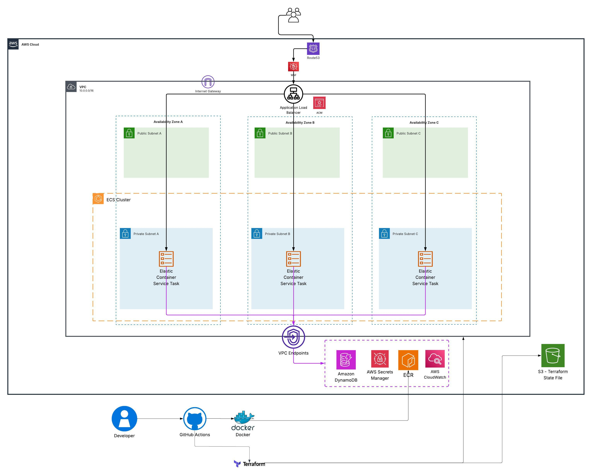
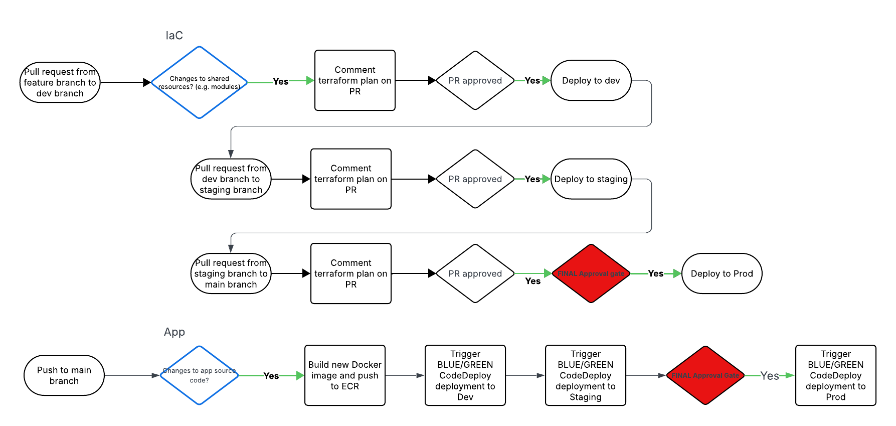
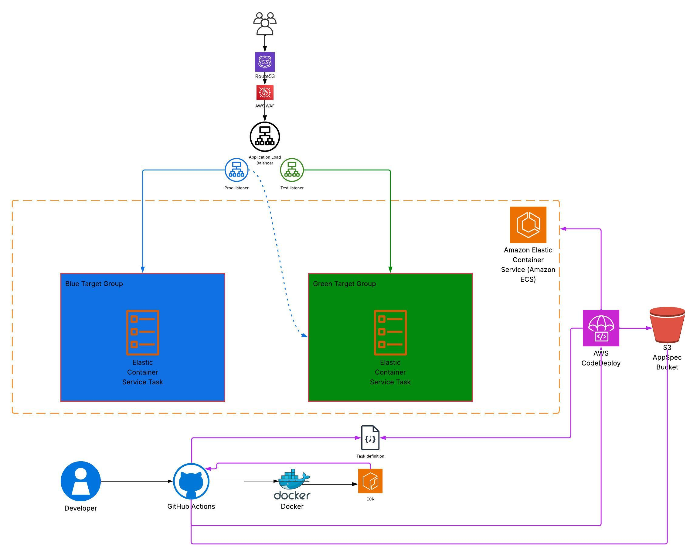
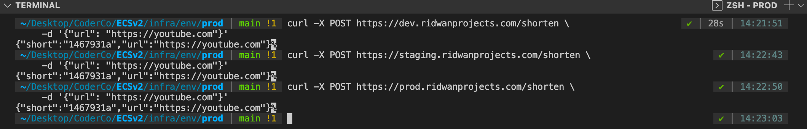
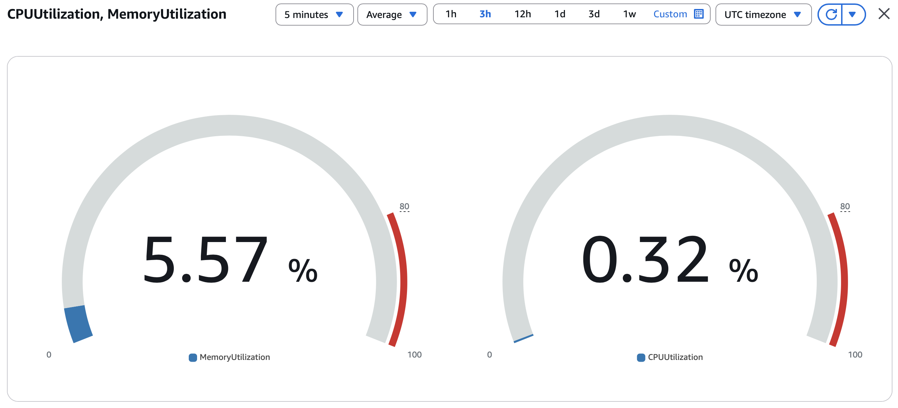
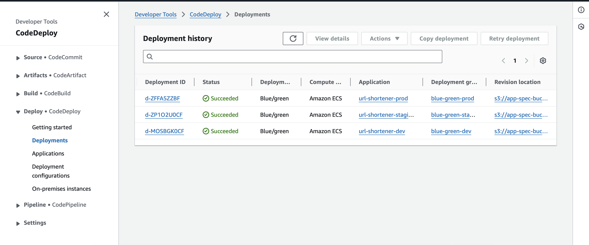

# URL Shortener: Production-Grade DevSecOps on AWS


## 📖 Overview

**Advanced Cloud Engineering & DevSecOps**

This project is a high-performance URL shortener service deployed on AWS ECS Fargate. It is engineered for **zero-trust networking** and **maximum cost-efficiency**, utilising VPC Endpoints to eliminate NAT Gateway costs and GitHub OIDC for secretless, secure deployments.

The service provides:
- **Shorten URLs:** `POST /shorten` with a long URL to receive a unique short code.
- **Redirects:** `GET /{short_code}` to redirect (302) to the original destination.

## Architecture Diagram
The diagram below illustrates the secure architecture of this deployment.


#### Description:
> - **ECS Fargate** cluster with tasks running in private subnets.  
> - **Public subnets** host the Application Load Balancer.  
> - **Application Load Balancer (ALB)** terminates TLS and routes traffic to ECS tasks. HTTP requests are redirected to HTTPS.  
> - **Amazon Route 53** manages DNS records for custom domain ridwanprojects.com.  
> - **AWS Certificate Manager (ACM)** provides SSL/TLS certificates with automated validation.  
> - **CloudWatch** collects and stores ECS task logs for observability.  
### Architecture Features

| AWS Resource / Tool                  | Purpose                                                                 |
|--------------------------------------|-------------------------------------------------------------------------|
| **Amazon ECS (Fargate)**             | Runs containers in a serverless, managed compute environment.           |
| **VPC Endpoints**                    | Private connectivity to ECR, S3, DynamoDB and Secrets Manager(eliminates NAT Gateway fees).|
| **Amazon ECR**                       | Stores and manages Docker images built by the CI/CD pipeline.           |
| **Application Load Balancer (ALB)**  | Distributes traffic across ECS tasks; handles HTTP to HTTPS redirection.|
| **AWS WAF**                          | Shields the ALB from SQL injection, XSS, and automated bot scanning.    |
| **Amazon Route 53**                  | Manages DNS records for the custom subdomains (${var.env}.ridwanprojects.com).         |
| **AWS Certificate Manager (ACM)**    | Issues and manages TLS certificates with automated validation.          |
| **Amazon CloudWatch**                | Collects ECS task logs and provides monitoring and metrics.              |
| **AWS IAM**                          | Manages roles and policies following least privilege principle.         |
| **AWS S3 (Terraform Backend)**       | Stores Terraform state file with native state locking.                  |
| **AWS CodeDeploy**                   | Manages Blue/Green canary shifts with automated health-check rollbacks.  |
### Deployment Tools

| Deployment Tool                  | Purpose                                                                 |
|--------------------------------------|-------------------------------------------------------------------------|
| **GitHub Actions**                   | Automates build, scanning, and deployment pipelines.                    |
| **GitHub OIDC**                      | Short-lived credentials for deployments                                 |
| **Docker**                           | Builds and packages container images for deployment.             |
| **Checkov**                          | Scans Terraform code for security and compliance issues.                |
| **Terraform**                        | Infrastructure as Code used to provision and manage AWS resources.      |

## 🏗️ Project Structure

```text
.
├── .github/workflows/          # CI/CD Pipelines
├── url-shortener-service/      # Python Application & Dockerfile
├── images/                     # Architecture diagrams & screenshots
└── infra/
    ├── env/                    # Environment-specific configurations:
    │   ├── dev/                    # Development environment tfvars
    │   ├── prod/                   # Production environment tfvars
    │   └── staging/                # Staging environment tfvars
    ├── global/backend/         # S3 Bucket for TF State and AppSpec files
    └── modules/                # Reusable Infrastructure Modules:
        ├── acm/                    # SSL/TLS Certificate management
        ├── alb/                    # Application Load Balancer & Target Groups
        ├── codedeploy/             # Blue/Green deployment configurations
        ├── ddb/                    # DynamoDB Table (PAY_PER_REQUEST)
        ├── ecs/                    # ECS Cluster & Service Definitions
        ├── sg/                     # Security Group definitions
        └── vpc/                    # NAT-less Networking (VPC Endpoints)
```

## CI/CD Strategy

The deployment strategy follows a rigorous promotion model across Dev, Staging, and Prod environments, ensuring all changes are vetted through automated tests and manual approval gates.


# 1. Infrastructure as Code (IaC) Pipeline

**Promotion Flow:** Feature Branch ➔ Dev ➔ Staging ➔ Main (Prod).

**Automation:** Every Pull Request triggers a terraform plan which is commented back to the PR for review.

**Approval Gates:** Deployments to Staging and Prod require PR approval. A Final Approval Gate (manual intervention) is required specifically before the Production "Apply."

# 2. Application Pipeline

**Trigger:** Any push to the main branch.

**Process:** 
- 1. Builds a new Docker image and pushes it to Amazon ECR. 
- 2. Triggers an automated Blue/Green CodeDeploy to Dev. 
- 3. Promotes the deployment to Staging. 
- 4. Hits a Final Approval Gate before initiating the Blue/Green canary shift in Production.


# Reasoning

I intentionally architected two separate pipeline styles to showcase different DevOps philosophies:

* **Why the Strict IaC pipeline?** In production infrastructure, "moving fast and breaking things" can lead to catastrophic data loss or security breaches. The manual gates and sequential promotion ensure that the **Networking (VPC)** and **Security (WAF/IAM)** layers are change-controlled and audited.

* **Why the quick App pipeline?** For the application layer, the goal is "Time to Market." By automating the promotion to Staging and using **Blue/Green Canary shifts**, we achieve a high deployment frequency while using AWS CodeDeploy's automated rollbacks as a safety net if a bug is detected.

## Security and Compliance

- **Secretless Authentication** Using GitHub Actions OIDC (OpenID Connect), the pipeline assumes an IAM role dynamically. This removes the risk of compromised long-lived access keys.
- **Security groups** enforce least privilege:
  - ALB allows inbound HTTP/HTTPS traffic from the internet.
  - ECS tasks accept traffic only on the application port from the ALB security group.  
- **WAF** is deployed with AWS Managed Core Rule Set to mitigate:
  - SQL injection  
  - Cross-site scripting  
  - HTTP flood attacks  
  - Scanning probes and other common threats  
- **Network Isolation** ECS tasks run with zero internet access. All traffic to AWS services remains internal via Interface and Gateway VPC Endpoints.
- **IAM roles** follow the principle of least privilege:
  - ECS task execution role allows pulling images from ECR and sending logs to CloudWatch.
  - ECS task role is scoped strictly to GetItem and PutItem on the specific DynamoDB table ARN.
- **Checkov** scans Terraform configurations for misconfigurations.  
## Infrastructure as Code
- **Terraform** provisions AWS resources.  
- Modularised design follows DRY principles for maintainability and reusability.  
- Remote backend uses S3 for state storage with the new native state locking feature (no DynamoDB required).  

## Screenshots




## Local Setup
1. Clone the repository and move into the app directory.
```text
git clone https://github.com/1Ridwan/ECSv2.git
cd url-shorterner-service
```  
2. Use Docker to build the image and then run the container
```text
docker build -t url-shortener .
docker run -d -p 8080:8080 -e TABLE_NAME=your-ddb-table url-shortener
```  
Test the endpoint:
```
curl -X POST https://yourdomain.com/shorten \                            ✔ │ 2m 32s │ 22:21:46 
     -d '{"url": "https://google.com"}'
```

## Lessons Learned & Trade-offs
- **VPC Endpoint Complexity** For a NAT-less architecture to function, multiple endpoints are required. Missing just one prevents the ECS agent from starting.

- **Blue/Green Deployment Listeners** I learned that there must be an existing listener to the green target group for CodeDeploy to begin a Blue/Green deployment.

- **OIDC Benefits** Transitioning from static keys to OIDC was a major security milestone, ensuring the deployment role is only assumable by my specific GitHub repository and branch.

## Things to add in the future!

- Infracost/tfsec/Trivy in CI
- CloudWatch dashboard (add p50/p95 latency, 5xx, healthy host count)
- Add an analytics endpoint /stats/{short} to count and return redirect hits (DDB update).
- Add an expiry TTL for shortened links (DDB TTL attribute).
- Add a /bulk-shorten endpoint to shorten multiple URLs in one request.
- tore metadata (created_at, creator_ip) alongside the link.
- Push click events to SQS or Kinesis for later processing.
- Store WAF logs in S3 via Firehose.
- Add CloudFront in front of the ALB.
- Require an API key via API Gateway in front of the ALB.
- Add IP rate limiting via WAF rules.

## License

MIT License - feel free to use, fork, and deploy!